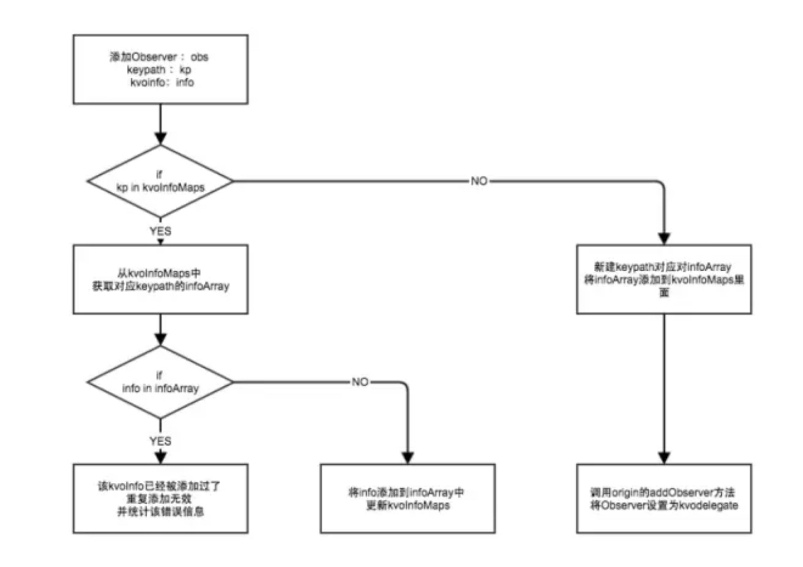

目前可以处理掉的crash类型具体有以下几种：

* unrecognized selector crash
* KVO crash
* NSNotification crash
* NSTimer crash
* Container crash（数组越界，插nil等）
* NSString crash （字符串操作的crash）
* Bad Access crash （野指针）
* UI not on Main Thread Crash \(非主线程刷UI\(机制待改善\)\)

接下来将一一详细介绍这8种类型的Crash的防护的实现的具体原理：


## 1. Unrecognized Selector类型

在一个函数找不到时，runtime提供了三种方式去补救：

**1、调用resolveInstanceMethod给个机会让类添加这个实现这个函数**

**2、调用forwardingTargetForSelector让别的对象去执行这个函数**

**3、调用forwardInvocation（函数执行器）灵活的将目标函数以其他形式执行。**

**如果都不中，调用doesNotRecognizeSelector抛出异常。**


既然可以补救，我们完全也可以利用消息转发机制来做文章。那么问题来了，在这三个步骤里面，选择哪一步去改造比较合适呢。

这里我们选择了第二步forwardingTargetForSelector来做文章。原因如下：

1. resolveInstanceMethod 需要在类的本身上动态添加它本身不存在的方法，这些方法对于该类本身来说冗余的
2. forwardInvocation可以通过NSInvocation的形式将消息转发给多个对象，但是其开销较大，需要创建新的NSInvocation对象，并且forwardInvocation的函数经常被使用者调用，来做多层消息转发选择机制，不适合多次重写
3. forwardingTargetForSelector可以将消息转发给一个对象，开销较小，并且被重写的概率较低，适合重写

选择了forwardingTargetForSelector之后，可以将NSObject的该方法重写，做以下几步的处理：

**1.动态创建一个桩类**

**2.动态为桩类添加对应的Selector，用一个通用的返回0的函数来实现该SEL的IMP**

**3.将消息直接转发到这个桩类对象上。**

注意如果对象的类本事如果重写了forwardInvocation方法的话，就不应该对forwardingTargetForSelector进行重写了，否则会影响到该类型的对象原本的消息转发流程。

通过重写NSObject的forwardingTargetForSelector方法，我们就可以将无法识别的方法进行拦截并且将消息转发到安全的*桩类*对象中，从而可以使app继续正常运行。

```
#import <Foundation/Foundation.h>

@interface ForwardingTarget : NSObject

@end


//.m 文件

#import "ForwardingTarget.h"
#import <objc/runtime.h>

@implementation ForwardingTarget

id ForwardingTarget_dynamicMethod(id self, SEL _cmd) {
   return [NSNull null];
}

+ (BOOL)resolveInstanceMethod:(SEL)sel {
   class_addMethod(self.class, sel, (IMP)ForwardingTarget_dynamicMethod, "@@:");
   [super resolveInstanceMethod:sel];
   return YES;
}

- (id)forwardingTargetForSelector:(SEL)aSelector {
   id result = [super forwardingTargetForSelector:aSelector];
   return result;
}

- (NSMethodSignature *)methodSignatureForSelector:(SEL)aSelector {
   id result = [super methodSignatureForSelector:aSelector];
   return result;
}

- (void)forwardInvocation:(NSInvocation *)anInvocation {
   [super forwardInvocation:anInvocation];
}

- (void)doesNotRecognizeSelector:(SEL)aSelector {
   [super doesNotRecognizeSelector:aSelector]; // crash
}

@end
```


```
//
//  NSObject+DoesNotRecognizeSelectorExtension.m
//  
//
//  Created by ChenYilong on 18/01/10.
//  Copyright © 2018年 All rights reserved.
//

#import "NSObject+DoesNotRecognizeSelectorExtension.h"
#import <objc/runtime.h>
#import "ForwardingTarget.h"

static ForwardingTarget *_target = nil;

@implementation NSObject (DoesNotRecognizeSelectorExtension)

+ (void)load {
   static dispatch_once_t onceToken;
   dispatch_once(&onceToken, ^{
       _target = [ForwardingTarget new];;
       not_recognize_selector_classMethodSwizzle([self class], @selector(forwardingTargetForSelector:), @selector(doesnot_recognize_selector_swizzleForwardingTargetForSelector:));
   });
}

- (id)doesnot_recognize_selector_swizzleForwardingTargetForSelector:(SEL)aSelector {
   id result = [self doesnot_recognize_selector_swizzleForwardingTargetForSelector:aSelector];
   if (result) {
       return result;
   }

   return _target;
}

#pragma mark - private method

BOOL not_recognize_selector_classMethodSwizzle(Class aClass, SEL originalSelector, SEL swizzleSelector) {
   Method originalMethod = class_getInstanceMethod(aClass, originalSelector);
   Method swizzleMethod = class_getInstanceMethod(aClass, swizzleSelector);
   BOOL didAddMethod =
   class_addMethod(aClass,
                   originalSelector,
                   method_getImplementation(swizzleMethod),
                   method_getTypeEncoding(swizzleMethod));
   if (didAddMethod) {
       class_replaceMethod(aClass,
                           swizzleSelector,
                           method_getImplementation(originalMethod),
                           method_getTypeEncoding(originalMethod));
   } else {
       method_exchangeImplementations(originalMethod, swizzleMethod);
   }
   return YES;
}

@end
```


## 2. KVO类型

首先我们来看看通过会导致KVO Crash的两种情形：

1. KVO的被观察者dealloc时仍然注册着KVO导致的crash
2. 添加KVO重复添加观察者或重复移除观察者（KVO注册观察者与移除观察者不匹配）导致的crash


一个被观察的对象(Observed Object)上有若干个观察者(Observer),每个观察者又观察若干条KeyPath。

如果观察者和keypath的数量一多，很容易理不清楚被观察对象整个KVO关系，导致被观察者在dealloc的时候，还残存着一些关系没有被注销。 同时还会导致KVO注册观察者与移除观察者不匹配的情况发生。

笔者曾经还遇到过在多线程的情况下，导致KVO重复添加观察者或移除观察者的情况。这类问题通常多数发生的比较隐蔽，不容易从代码的层面去排查。

由上可见多数由于KVO而导致的crash原因是由于被观察对象的KVO关系图混乱导致。那么如何来管理混乱的KVO关系呢。可以让被观察对象持有一个KVO的delegate，所有和KVO相关的操作均通过delegate来进行管理，delegate通过建立一张map来维护KVO整个关系

这样做的好处有两个：

1.如果出现KVO重复添加观察者或重复移除观察者（KVO注册观察者与移除观察者不匹配）的情况，delegate可以直接阻止这些非正常的操作。

2.被观察对象dealloc之前，可以通过delegate自动将与自己有关的KVO关系都注销掉，避免了KVO的被观察者dealloc时仍然注册着KVO导致的crash。

被swizzle的方法分别是：

```objective-c
- (void)addObserver:(NSObject *)observer 
			forKeyPath:(NSString *)keyPath
			 	options:(NSKeyValueObservingOptions)options 
			 	context:(nullable void *)context;

- (void)removeObserver:(NSObject *)observer forKeyPath:(NSString *)keyPath;

- (void)observeValueForKeyPath:(nullable NSString *)keyPath ofObject:(nullable id)object change:(nullable NSDictionary<NSKeyValueChangeKey, id> *)change context:(nullable void *)context;
```


流程如下图：




**还有另外一个办法就是**

建立一个哈希表，用来保存，观察者，keyPath的信息，如果哈希表里已经有了相关的观察者，keyPath信息，那么继续添加观察者的话，就不载进行添加，同样移除观察的时候，也现在哈希表中进行查找，如果存在观察者，keypath信息，那么移除，如果没有的话就不执行相关的移除操作


## 3. NSNotification类型

当一个对象添加了notification之后，如果dealloc的时候，仍然持有notification，就会出现NSNotification类型的crash。

NSNotification类型的crash多产生于程序员写代码时候犯疏忽，在NSNotificationCenter添加一个对象为observer之后，忘记了在对象dealloc的时候移除它。

所幸的是，**苹果在iOS9之后专门针对于这种情况做了处理**，所以在iOS9之后，即使开发者没有移除observer，Notification crash也不会再产生了。

不过针对于iOS9之前的用户，我们还是有必要做一下NSNotification Crash的防护的。


**防护方案**

NSNotification Crash的防护原理很简单， 利用method swizzling hook NSObject的dealloc函数，再对象真正dealloc之前先调用一下[[NSNotificationCenter defaultCenter] removeObserver:self]即可。

注意到并不是所有的对象都需要做以上的操作，如果一个对象从来没有被NSNotificationCenter 添加为observer的话，在其dealloc之前调用removeObserver完全是多此一举。 所以我们hook了NSNotificationCenter的

addObserver:(id)observer selector:(SEL)aSelector name:(NSString *)aName object:(id)anObject

函数，在其添加observer的时候，对observer动态添加标记flag。这样在observer dealloc的时候，就可以通过flag标记来判断其是否有必要调用removeObserver函数了。


## 4. NSTimer类型

在程序开发过程中，大家会经常使用定时任务，但使用NSTimer的 `scheduledTimerWithTimeInterval:target:selector:userInfo:repeats:`接口做重复性的定时任务时存在一个问题：NSTimer会强引用target实例，所以需要在合适的时机invalidate定时器，否则就会由于定时器timer强引用target的关系导致target不能被释放，造成内存泄露，甚至在定时任务触发时导致crash。 crash的展现形式和具体的target执行的selector有关。

与此同时，如果NSTimer是无限重复的执行一个任务的话，也有可能导致target的selector一直被重复调用且处于无效状态，对app的CPU，内存等性能方面均是没有必要的浪费。

所以，很有必要设计出一种方案，可以有效的防护NSTimer的滥用问题


**防护方案**

解决NSTimer的问题的关键点在于以下两点：

1. NSTimer对其target是否可以不强引用
2. 是否找到一个合适的时机，在确定NSTimer已经失效的情况下，让NSTimer自动invalidate


关于第一个问题，target的强引用问题。 可以用如下图的方案来解决：


同时NSTimer强引用stubTarget，而stubTarget弱引用target，这样target和NSTimer之间的关系也就是弱引用了，意味着target可以自由的释放，从而解决了循环引用的问题。

**还有一种解决办法是使用`NSProxy`**

## 5. Container类型

Container crash 类型的防护方案也比较简单，针对于NSArray／NSMutableArray／NSDictionary／NSMutableDictionary／NSCache的一些常用的会导致崩溃的API进行method swizzling，然后在swizzle的新方法中加入一些条件限制和判断，从而让这些API变的安全


##6. NSString类型crash防护

NSString／NSMutableString 类型的crash的产生原因和防护方案与Container crash很相像

## 7. 野指针类型

解决野指针导致的crash往往是一件棘手的事情，一来产生crash 的场景不好复现，二来crash之后console的信息提供的帮助有限。 XCode本身为了便于开放调试时发现野指针问题，提供了Zombie机制，能够在发生野指针时提示出现野指针的类，从而解决了开发阶段出现野指针的问题。然而针对于线上产生的野指针问题，依旧没有一个比较好的办法来定位问题。

所以，因为野指针出现概率高而且难定位问题，非常有必要针对于野指针专门做一层防护措施。


**防护方案**

野指针问题的解决思路方向其实很容易确定，XCode提供了Zombie的机制来排查野指针的问题，那么我们这边可以实现一个类似于Zombie的机制，加上对zombie实例的全部方法拦截机制 和 消息转发机制，那么就可以做到在野指针访问时不Crash而只是crash时相关的信息。

同时还需要注意一点：因为zombie的机制需要在对象释放时保留其指针和相关内存占用，随着app的进行，越来越多的对象被创建和释放，这会导致内存占用越来越大，这样显然对于一个正常运行的app的性能有影响。所以需要一个合适的zombie对象释放机制，确定zombie机制对内存的影响是有限度的

improve版的zombie机制的实现主要分为以下四个环节：

* step 1. method swizzling替换NSObject的allocWithZone方法，在新的方法中判断该类型对象是否需要加入野指针防护，如果需要，则通过objc_setAssociatedObject为该对象设置flag标记，被标记的对象后续会进入zombie流程
* step 2. method swizzling替换NSObject的dealloc方法，对flag标记的对象实例调用objc_destructInstance，释放该实例引用的相关属性，然后将实例的isa修改为HTZombieObject。通过objc_setAssociatedObject 保存将原始类名保存在该实例中。
* Step 3. 在HTZombieObject 通过消息转发机制forwardingTargetForSelector处理所有拦截的方法，根据selector动态添加能够处理方法的响应者HTStubObject 实例，然后通过 objc_getAssociatedObject 获取之前保存该实例对应的原始类名，统计错误数据。
* Step 4. 当退到后台或者达到未释放实例的上限时，则在ht_freeSomeMemory方法中调用原有dealloc方法释放所有被zombie化的实例

**相关的风险**

1. 做了野指针防护，通过动态插入一个空实现的方法来防止出现Crash，但是业务层面的表现难以确定，可能会进入业务异常的状态。需要拟定一下如何展现该问题给用户的方案。
2. 由于做了延时释放若干实例，对系统总内存会产生一定影响，目前将内存的缓冲区开到2M左右，所以应该没有很大的影响，但还是可能潜在一些风险。
3. 延时释放实例是根据相关功能代码会聚焦在某一个时间段调用的假设前提下，所以野指针的zombie保护机制只能在其实例对象仍然缓存在zombie的缓存机制时才有效，若在实例真正释放之后，再调用野指针还是会出现Crash。

## 8 非主线程刷UI类型

在非主线程刷UI将会导致app运行crash，有必要对其进行处理。

目前初步的处理方案是swizzle UIView类的以下三个方法：

```
- (void)setNeedsLayout;
- (void)setNeedsDisplay;
- (void)setNeedsDisplayInRect:(CGRect)rect;
```

在这三个方法调用的时候判断一下当前的线程，如果不是主线程的话，直接利用 `dispatch_async(dispatch_get_main_queue(), ^{ //调用原本方法 });`

来将对应的刷UI的操作转移到主线程上，同时统计错误信息。

但是真正实施了之后，发现这三个方法并不能完全覆盖UIView相关的所有刷UI到操作，但是如果要将全部到UIView的刷UI的方法统计起来并且swizzle，感觉略笨拙而且不高效。

**目前 debug 模式下在 xcode 打开主线程测试可以大大减少开发过程中这类问题**