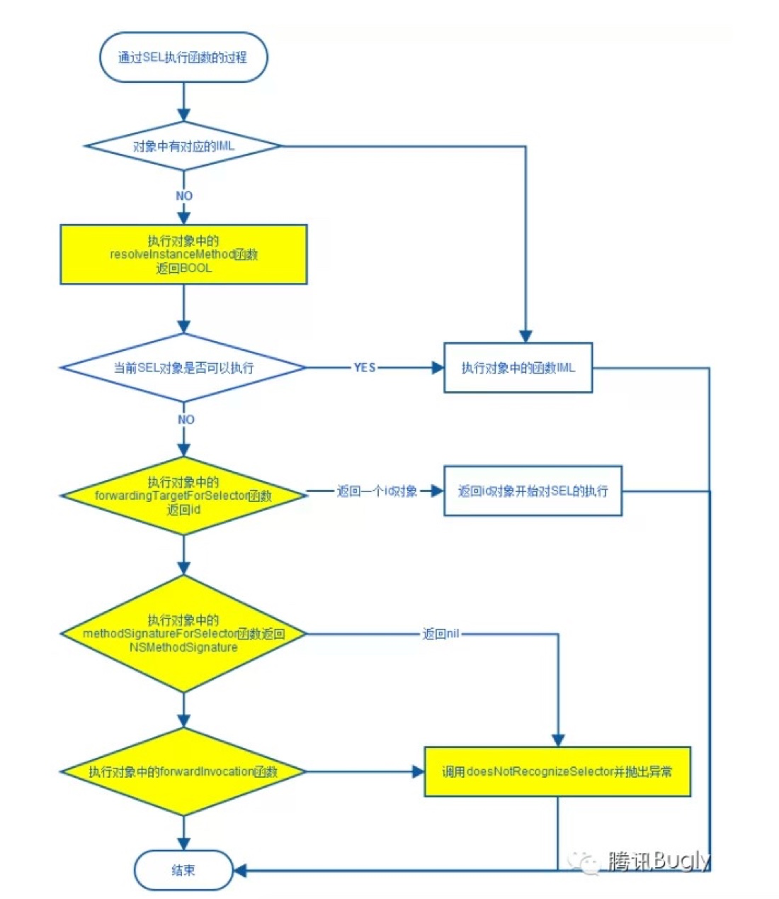

寻找IMP的过程:
1. 先从当前class的cache方法列表（cache methodLists）里去找
2. 找到了，跳到对应函数实现
3. 没找到，就从class的方法列表（methodLists）里找
4. 还找不到，就到super class的cache方法列表和方法列表里找，直到找到基类(NSObject)为止
5. 最后再找不到，就会进入动态方法解析和消息转发的机制。

消息转发过程的关键方法

* 动态方法解析
向当前类发送resolveInstanceMethod:消息，检查是否动态向类添加了方法，如果返回YES，则系统认为方法已经被添加，则会重新发送消息。
* 快速消息转发
检查当前类是否实现forwardingTargetForSelector:方法，若实现则调用，如果方法返回值为非nil或非self的对象，则向返回的对象重新发送消息。
* 标准消息转发
Runtime发送methodSignatureForSelector:消息获取selector对应方法的签名，如果有方法签名返回，则根据方法签名创建描述消息的NSInvocation，向当前对象发送forwardInvocation:消息，如果没有方法签名返回，即返回值为nil，则向当前对象发送doesNotRecognizeSelector:消息，应用崩溃退出。