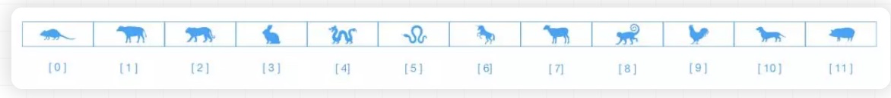
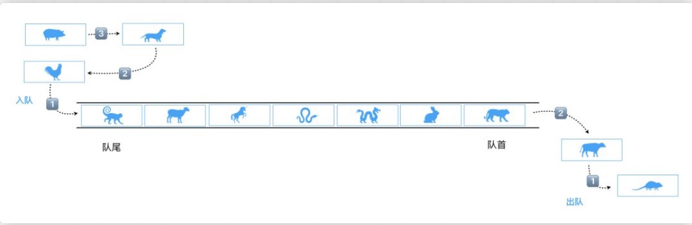
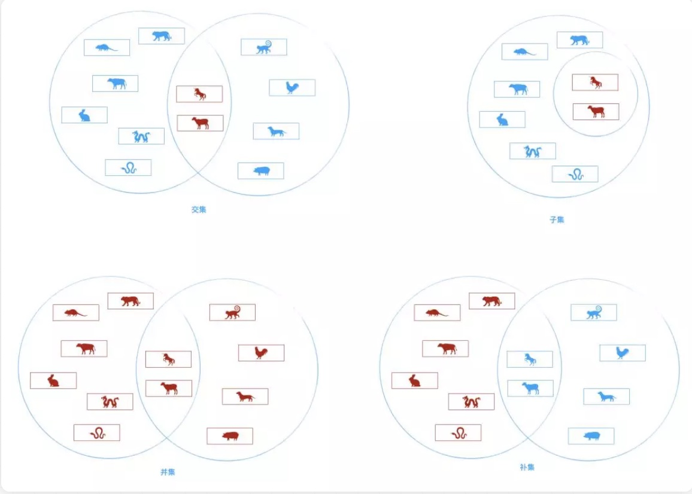
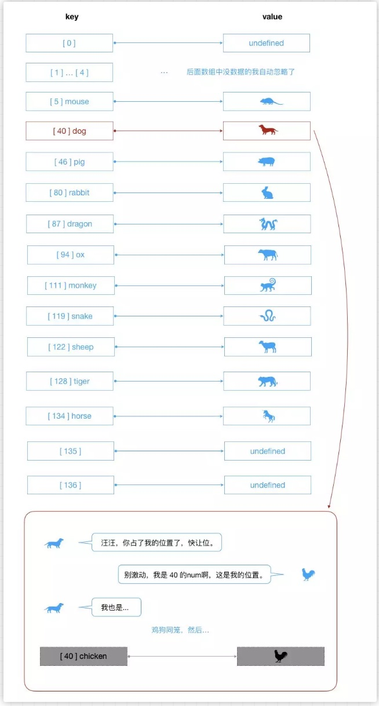
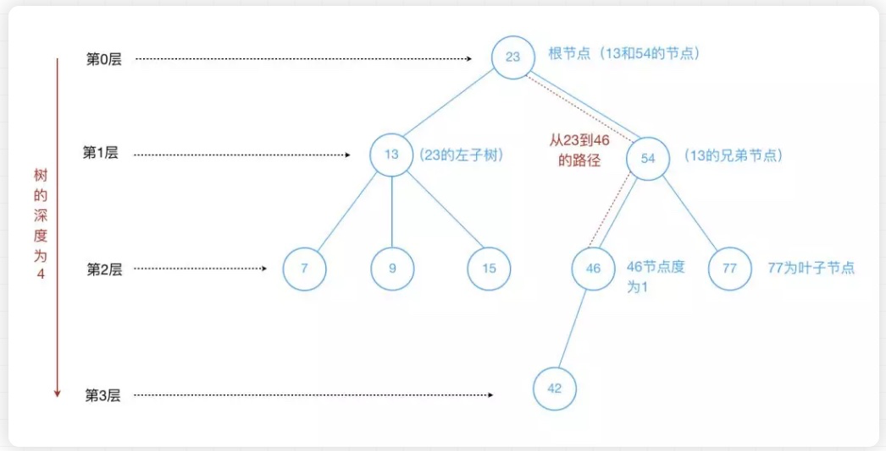
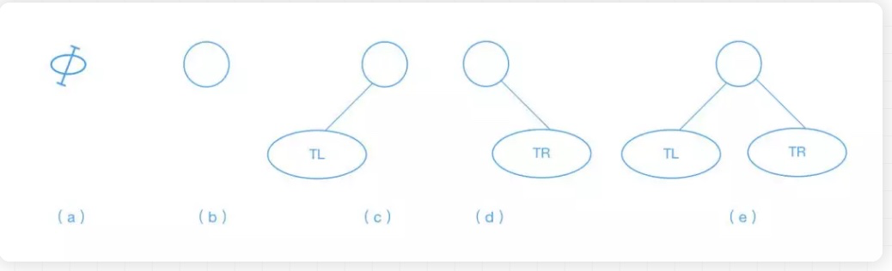
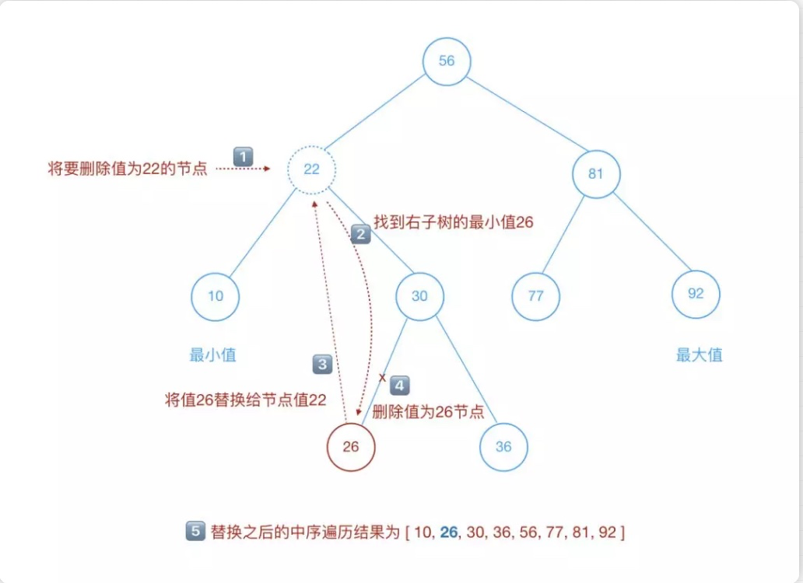
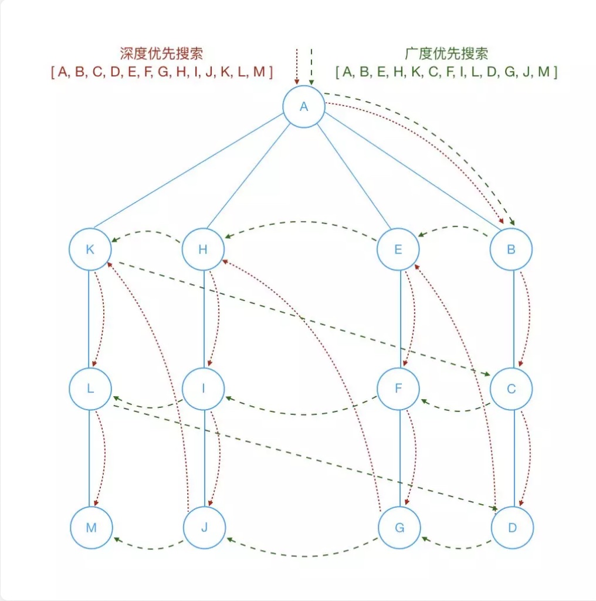

**数据结构**是计算机存储、组织数据的方式。**数据结构**是指相互直接存在一种或多种特殊关系的数据元素的集合。通常情况下，精心选择数据结构可以带来更高的运行或者存储效率。作为一名程序猿，更需要了解下数据结构。

讲到数据结构，我们都会谈到线性结构和非线性结构。

**1.线性结构**是一个有序数据元素的集合。它应该满足下面的特征：

- 集合中必存在唯一的一个“第一个元素”
- 集合中必存在唯一的一个“最后的元素”
- 除最后一元素之外，其它数据元素均有唯一的“后继”
- 除第一个元素之外，其它数据元素均有唯一的“前驱”

按照百度百科的定义，我们知道符合条件的数据结构就有栈、队列和其它。

**2.非线性结构**其逻辑特征是一个节点元素可以有多个直接前驱或多个直接后继。

那么，符合条件的数据结构就有图、树和其它。

嗯～了解一下就行。我们进入正题：

### 数组

数组是一种线性结构，以十二生肖（鼠、牛、虎、兔、龙、蛇、马、羊、猴、鸡、狗、猪）排序为例：

我们来创建一个数组并打印出结果就一目了然了：

```
let arr = ['鼠', '牛', '虎', '兔', '龙', '蛇', '马', '羊', '猴', '鸡', '狗', '猪'];
arr.forEach((item, index) => {
    console.log(`[ ${index} ] => ${item}`);
});

// [ 0 ] => 鼠
// [ 1 ] => 牛
// [ 2 ] => 虎
// [ 3 ] => 兔
// [ 4 ] => 龙
// [ 5 ] => 蛇
// [ 6 ] => 马
// [ 7 ] => 羊
// [ 8 ] => 猴
// [ 9 ] => 鸡
// [ 10 ] => 狗
// [ 11 ] => 猪
```

### 栈

**栈**是一种后进先出(LIFO)线性表，是一种基于数组的数据结构。（ps：其实后面讲到的数据结构或多或少有数组的影子）

- LIFO(Last In First Out)表示后进先出，后进来的元素第一个弹出栈空间。类似于自动餐托盘，最后放上去的托盘，往往先被拿出来使用。

- 仅允许在表的一端进行插入和移除元素。这一端被称为**栈顶**，相对地，把另一端称为**栈底**。如下图的标识。

- 向一个栈插入新元素称作**进栈、入栈或压栈**，这是将新元素放在栈顶元素上面，使之成为新的栈顶元素。

- 从一个栈删除元素又称为**出栈或退栈**，它是把栈顶元素删除掉，使其相邻的元素成为新的栈顶元素。

  

stack_demo

我们代码写下，熟悉下栈：

```
class Stack {
    constructor(){
        this.items = [];
    }
    // 入栈操作
    push(element = ''){
        if(!element) return;
        this.items.push(element);
        return this;
    }
    // 出栈操作
    pop(){
        this.items.pop();
        return this;
    }
    // 对栈一瞥，理论上只能看到栈顶或者说即将处理的元素
    peek(){
        return this.items[this.size() - 1];
    }
    // 打印栈数据
    print(){
        return this.items.join(' ');
    }
    // 栈是否为空
    isEmpty(){
        return this.items.length == 0;
    }
    // 返回栈的元素个数
    size(){
        return this.items.length;
    }
}
```

⚠️ 注意：栈这里的push和pop方法要和数组方法的push和pop方法区分下。

### 队列

**队列**是一种先进先出（FIFO）受限的线性表。受限体现在于其允许在表的前端（front）进行删除操作，在表的末尾（rear）进行插入【优先队列这些排除在外】操作。





代码走一遍：

```
class Queue {
    constructor(){
        this.items = [];
    }
    // 入队操作
    enqueue(element = ''){
        if(!element) return;
        this.items.push(element);
        return this;
    }
    // 出队操作
    dequeue(){
        this.items.shift();
        return this;
    }
    // 查看队前元素或者说即将处理的元素
    front(){
        return this.items[0];
    }
    // 查看队列是否为空
    isEmpty(){
        return this.items.length == 0;
    }
    // 查看队列的长度
    len(){
        return this.items.length;
    }
    // 打印队列数据
    print(){
        return this.items.join(' ');
    }
}
```

### 链表

在进入正题之前，我们先来聊聊数组的优缺点。

**优点：**

- 存储多个元素，比较常用
- 访问便捷，使用下标[index]即可访问

**缺点：**

- 数组的创建通常需要申请一段连续的内存空间，并且大小是固定的（大多数的编程语言数组都是固定的），所以在进行扩容的时候难以掌控。（一般情况下，申请一个更大的数组，会是之前数组的倍数，比如两倍。然后，再将原数组中的元素复制过去）
- 插入数据越是靠前，其成本很高，因为需要进行大量元素的位移。

相对数组，链表亦可以存储多个元素，而且存储的元素在内容中不必是连续的空间；在插入和删除数据时，时间复杂度可以达到O(1)。在查找元素的时候，还是需要从头开始遍历的，比数组在知道下表的情况下要快，但是数组如果不确定下标的话，那就另说了…

我们使用十二生肖来了解下链表：

linklist_demo

**链表**是由一组节点组成的集合。每个节点都使用一个对象的引用指向它的后继。如上图。下面用代码实现下：

```
// 链表
class Node {
    constructor(element){
        this.element = element;
        this.next = null;
    }
}

class LinkedList {
    constructor(){
        this.length = 0; // 链表长度
        this.head = new Node('head'); // 表头节点
    }
    /**
     * @method find 查找元素的功能，找不到的情况下直接返回链尾节点
     * @param { String } item 要查找的元素
     * @return { Object } 返回查找到的节点 
     */
    find(item = ''){
        let currNode = this.head;
        while(currNode.element != item && currNode.next){
            currNode = currNode.next;
        }
        return currNode;
    }
    /**
    * @method findPrevious 查找链表指定元素的前一个节点
    * @param { String } item 指定的元素
    * @return { Object } 返回查找到的之前元素的前一个节点，找不到节点的话返回链尾节点
    */
    findPrevious(item){
        let currNode = this.head;
        while((currNode.next != null) && (currNode.next.element != item)){
            currNode = currNode.next;
        }
        return currNode;
    }
    /**
     * @method insert 插入功能
     * @param { String } newElement 要出入的元素
     * @param { String } item 想要追加在后的元素（此元素不一定存在）
     */
    insert(newElement = '', item){
        if(!newElement) return;
        let newNode = new Node(newElement),
            currNode = this.find(item);
        newNode.next = currNode.next;
        currNode.next = newNode;
        this.length++;
        return this;
    }
    // 展示链表元素
    display(){
        let currNode = this.head,
            arr = [];
        while(currNode.next != null){
            arr.push(currNode.next.element);
            currNode = currNode.next;
        }
        return arr.join(' ');
    }
    // 链表的长度
    size(){
        return this.length;
    }
    // 查看链表是否为空
    isEmpty(){
        return this.length == 0;
    }
    /**
     * @method indexOf 查看链表中元素的索引
     * @param { String } element 要查找的元素
     */
    indexOf(element){
        let currNode = this.head,
            index = 0;
        while(currNode.next != null){
            index++;
            if(currNode.next.element == element){
                return index;
            }
            currNode = currNode.next;
        }
        return -1;
    }
    /**
     * @method removeEl 移除指定的元素
     * @param { String } element 
     */
    removeEl(element){
        let preNode = this.findPrevious(element);
        preNode.next = preNode.next != null ? preNode.next.next : null;
    }
}
```

### 字典

**字典**的主要特点是键值一一对应的关系。可以比喻成我们现实学习中查不同语言翻译的`字典`。这里字典的键（key）理论上是可以使用任意的内容，但还是建议语意化一点，比如下面的十二生肖图：

dictionary_demo

```
class Dictionary {
    constructor(){
        this.items = {};
    }
    /**
     * @method set 设置字典的键值对
     * @param { String } key 键
     * @param {*} value 值
     */
    set(key = '', value = ''){
        this.items[key] = value;
        return this;
    }
    /**
     * @method get 获取某个值
     * @param { String } key 键
     */
    get(key = ''){
        return this.has(key) ? this.items[key] : undefined;
    }
    /**
     * @method has 判断是否含有某个键的值
     * @param { String } key 键
     */
    has(key = ''){
        return this.items.hasOwnProperty(key);
    }
    /**
     * @method remove 移除元素
     * @param { String } key 
     */
    remove(key){
        if(!this.has(key))  return false;
        delete this.items[key];
        return true;
    }
    // 展示字典的键
    keys(){
        return Object.keys(this.items).join(' ');
    }
    // 字典的大小
    size(){
        return Object.keys(this.items).length;
    }
    // 展示字典的值
    values(){
        return Object.values(this.items).join(' ');
    }
    // 清空字典
    clear(){
        this.items = {};
        return this;
    }
}
```

### 集合

**集合**通常是由一组无序的，不能重复的元素构成。 一些常见的集合操作如图：



es6中已经封装好了可用的Set类。我们手动来写下相关的逻辑：


```
// 集合
class Set {
    constructor(){
        this.items = [];
    }
    /**
     * @method add 添加元素
     * @param { String } element 
     * @return { Boolean }
     */
    add(element = ''){
        if(this.items.indexOf(element) >= 0) return false;
        this.items.push(element);
        return true;
    }
    // 集合的大小
    size(){
        return this.items.length;
    }
    // 集合是否包含某指定元素
    has(element = ''){
        return this.items.indexOf(element) >= 0;
    }
    // 展示集合
    show(){
        return this.items.join(' ');
    }
    // 移除某个元素
    remove(element){
        let pos = this.items.indexOf(element);
        if(pos < 0) return false;
        this.items.splice(pos, 1);
        return true;
    }
    /**
     * @method union 并集
     * @param { Array } set 数组集合
     * @return { Object } 返回并集的对象
     */
    union(set = []){
        let tempSet = new Set();
        for(let i = 0; i < this.items.length; i++){
            tempSet.add(this.items[i]);
        }
        for(let i = 0; i < set.items.length; i++){
            if(tempSet.has(set.items[i])) continue;
            tempSet.items.push(set.items[i]);
        }
        return tempSet;
    }
    /**
     * @method intersect 交集
     * @param { Array } set 数组集合
     * @return { Object } 返回交集的对象
     */
    intersect(set = []){
        let tempSet = new Set();
        for(let i = 0; i < this.items.length; i++){
            if(set.has(this.items[i])){
                tempSet.add(this.items[i]);
            }
        }
        return tempSet;
    }
    /**
     * @method isSubsetOf 【A】是【B】的子集❓
     * @param { Array } set 数组集合
     * @return { Boolean } 返回真假值
     */
    isSubsetOf(set = []){
        if(this.size() > set.size()) return false;
        this.items.forEach*(item => {
            if(!set.has(item)) return false;
        });
        return true;
    }
}
```

### 散列表/哈希表

散列是一种常用的存储技术，散列使用的数据结构叫做**散列表/哈希表**。在散列表上插入、删除和取用数据都非常快，但是对于查找操作来说却效率低下，比如查找一组数据中的最大值和最小值。查找的这些操作得求助其它数据结构，比如下面要讲的二叉树。

切入个案例感受下哈希表：

**假如一家公司有1000个员工, 现在我们需要将这些员工的信息使用某种数据结构来保存起来。你会采用什么数据结构呢？**

- 方案一：数组
- 按照顺序将所有员工信息依次存入一个长度为1000的数组中。每个员工的信息都保存在该数组的某个位置上。
- 但是我们要查看某个员工的信息怎么办呢？一个个查找吗？不太好找。
- 数组最大的优势是什么？通过下标值获取信息。
- 所以为了可以通过数组快速定位到某个员工，最好给员工信息中添加一个员工编号，而`编号`对应的就是员工的`下标值`。
- 当查找某个员工信息时，通过员工号可以快速定位到员工的信息位置。
- 方案二：链表
- 链表对应插入和删除数据有一定的优势。
- 但是对于获取员工的信息，每次都必须从头遍历到尾，这种方式显然不是特别适合我们这里。
- 最终方案：
- 这么看最终方案似乎就是数组了，但是数组还是有缺点，什么缺点呢？
- 假如我们想查看下张三这位员工的信息，但是我们不知道张三的员工编号，怎么办呢？
- 当然，我们可以问他的员工编号。但是我们每查找一个员工都是要问一下这个员工的编号吗？不合适。【那我们还不如直接问他的信息嘞】
- 能不能有一种办法，让张三的名字和他的员工编号产生直接的关系呢？
- 也就是通过张三这个名字，我们就能获取到他的索引值，而再通过索引值我们就能获取张三的信息呢？
- 这样的方案已经存在了，就是使用哈希函数，让某个key的信息和索引值对应起来。

那么散列表的原理和实现又是怎样的呢，我们来聊聊。

我们的哈希表是基于数组完成的，我们从数组这里切入解析下。`数组可以通过下标直接定位到相应的空间`，哈希表的做法就是类似的实现。哈希表把`key(键)`通过一个固定的算法函数（此函数称为哈希函数/散列函数）转换成一个整型数字，然后就将该数字对数组长度进行**取余**，取余结果就当作数组的下标，将`value(值)`存储在以该数字为下标的数组空间里，而当使用哈希表进行查询的时候，就是再次使用哈希函数将`key`转换为对应的数组下标，并定位到该空间获取`value`。

结合下面的代码，也许你会更容易理解：

```
// 哈希表
class HashTable {
    constructor(){
        this.table = new Array(137);
    }
    /**
     * @method hashFn 哈希函数
     * @param { String } data 传入的字符串
     * @return { Number } 返回取余的数字
     */
    hashFn(data){
        let total = 0;
        for(let i = 0; i < data.length; i++){
            total += data.charCodeAt(i);
        }
        return total % this.table.length;
    }
    /**
     * 
     * @param { String } data 传入的字符串
     */
    put(data){
        let pos = this.hashFn(data);
        this.table[pos] = data;
        return this;
    }
    // 展示
    show(){
        this.table && this.table.forEach((item, index) => {
            if(item != undefined){
                console.log(index + ' => ' + item);
            }
        })
    }
    // ...获取值get函数等看官感兴趣的话自己补充测试啦
}
```





针对上面的问题，我们存储数据的时候，产生冲突的话我们可以像下面这样解决：

**1. 线性探测法**

当发生碰撞（冲突）时，线性探测法检查散列表中的下一个位置【有可能非顺序查找位置，不一定是下一个位置】是否为空。如果为空，就将数据存入该位置；如果不为空，则继续检查下一个位置，直到找到一个空的位置为止。该技术是基于一个事实：每个散列表都有很多空的单元格，可以使用它们存储数据。

**2. 开链法**

但是，当发生碰撞时，我们任然希望将`key（键）`存储到通过哈希函数产生的索引位置上，那么我们可以使用**开链法**。**开链法**是指实现哈希表底层的数组中，每个数组元素又是一个新的数据结构，比如另一个数组（这样结合起来就是二位数组了），链表等，这样就能存储多个键了。使用这种技术，即使两个`key（键）`散列后的值相同，依然是被保存在同样的位置，只不过它们是被保存在另一个数据结构上而已。以另一个数据结构是数组为例，存储的数据如下：

open_link_method

### 二叉查找树

- 树的定义：

- 树（Tree）：`n(n &gt;= 0)`个节点构成的有限集合。

- - 当`n = 0`时，称为空树；
  - 对任意一棵空树`(n > 0)`，它具备以下性质：
  - 树中有一个称为**根(Root)**的特殊节点，用`r(root)`表示；
  - 其余节点可分为`m(m > 0)`个互不相交的有限集`T1,T2,…Tm`，其中每个集合本省又是一棵树，称为原来树的**子树（SubTree）**

- 注意：

- - 子树之间`不可以相交`；
  - 除了根节点外，每个节点有且仅有一个父节点；
  - 一个`N`个节点的树有`N-1`条边。

- 树的术语：

- 节点的度（Degree）：节点的子树个数。

- 树的度：树的所有节点中最大的度数（树的度通常为节点个数的`N-1`）。

- 叶节点（Leaf）：度为`0`的节点（也称叶子节点）。

- 父节点（Parent）：有子树的节点是其子树的父节点。

- 子节点（Child）：若`A`节点是`B`节点的父节点，则称`B`节点是`A`节点的子节点。

- 兄弟节点（Sibling）：具有同一个父节点的各节点彼此是兄弟节点。

- 路径和路径长度：从节点`n1`到`nk`的路径为一个节点序列`n1,n2,n3,…,nk`，`ni`是`ni+1`的父节点。路径所包含边的个数为路径长度。

- 节点的层次（Level）：规定根节点在`第0层`，它的子节点是`第1层`，子节点的子节点是`第2层`，以此类推。

- 树的深度（Depth）：树中所有节点中的最大层次是这棵树的深度（因为上面是从第0层开始，深度 = 第最大层数 + 1）

如下图：

tree_intro

- 二叉树的定义：
- 二叉树可以为空，也就是没有节点
- 二叉树若不为空，则它是由根节点和称为其左子树`TL`和右子树`RT`的两个不相交的二叉树组成
- 二叉树每个节点的子节点不允许超过`两个`
- 二叉树的五种形态：
- 空
- 只有根节点
- 只有左子树
- 只有右子树
- 左右子树均有

对应下图（从左至右）：

five_style_binary_tree

我们接下来要讲的是**二叉查找树（BST，Binary Search Tree）**。**二叉查找树**，也称二叉搜索树或二叉排序树，是一种特殊的二叉树，相对值较`小`的值保存在`左`节点中，较`大`的值保存在`右`节点中。二叉查找树特殊的结构使它能够快速的进行查找、插入和删除数据。下面我们来实现下：

```
// 二叉查找树
// 辅助节点类
class Node {
    constructor(data, left, right){
        this.data = data;
        this.left = left;
        this.right = right;
    }
    // 展示节点信息
    show(){
        return this.data;
    }
}
class BST {
    constructor(){
        this.root = null;
    }
    // 插入数据
    insert(data){
        let n = new Node(data, null, null);
        if(this.root == null){
            this.root = n;
        }else{
            let current = this.root,
                parent = null;
            while(true){
                parent = current;
                if(data < current.data){
                    current = current.left;
                    if(current == null){
                        parent.left = n;
                        break;
                    }
                }else{
                    current = current.right;
                    if(current == null){
                        parent.right = n;
                        break;
                    }
                }
            }
        }
        return this;
    }
    // 中序遍历
    inOrder(node){
        if(!(node == null)){
            this.inOrder(node.left);
            console.log(node.show());
            this.inOrder(node.right);
        }
    }
    //   先序遍历
    preOrder(node){
        if(!(node == null)){
            console.log(node.show());
            this.preOrder(node.left);
            this.preOrder(node.right);
        }
    }
    // 后序遍历
    postOrder(node){
        if(!(node == null)){
            this.postOrder(node.left);
            this.postOrder(node.right);
            console.log(node.show());
        }
    }
    // 获取最小值
    getMin(){
        let current = this.root;
        while(!(current.left == null)){
            current = current.left;
        }
        return current.data;
    }
    // 获取最大值
    getMax(){
        let current = this.root;
        while(!(current.right == null)){
            current = current.right;
        }
        return current.data;
    }
    // 查找给定的值
    find(data){
        let current = this.root;
        while(current != null){
            if(current.data == data){
                return current;
            }else if(data < current.data){
                current = current.left;
            }else{
                current = current.right;
            }
        }
        return null;
    }
    // 移除给定的值
    remove(data){
        root = this.removeNode(this.root, data);
        return this;
    }
    // 移除给定值的辅助函数
    removeNode(node, data){
        if(node == null){
            return null;
        }
        if(data == node.data){
            // 叶子节点
            if(node.left == null && node.right == null){
                return null; // 此节点置空
            }
            // 没有左子树
            if(node.left == null){
                return node.right;
            }
            // 没有右子树
            if(node.right == null){
                return node.left;
            }
            // 有两个子节点的情况
            let tempNode = this.getSmallest(node.right); // 获取右子树
            node.data = tempNode.data; // 将其右子树的最小值赋值给删除的那个节点值
            node.right = this.removeNode(node.right, tempNode.data); // 删除指定节点的下的最小值，也就是置其为空
            return node;
        }else if(data < node.data){
            node.left = this.removeNode(node.left, data);
            return node;
        }else{
            node.right = this.removeNode(node.right, data);
            return node;
        }
    }
    // 获取给定节点下的二叉树最小值的辅助函数
    getSmallest(node){
        if(node.left == null){
            return node;
        }else{
            return this.getSmallest(node.left);
        }
    }
}
```

看了上面的代码之后，你是否有些懵圈呢？我们借助几张图来了解下，或许你就豁然开朗了。

在遍历的时候，我们分为三种遍历方法--先序遍历，中序遍历和后序遍历：

travel_tree

删除节点是一个比较复杂的操作，考虑的情况比较多：

- 该节点没有叶子节点的时候，直接将该节点置空；
- 该节点只有左子树，直接将该节点赋予左子树
- 该节点只有右子树，直接将该节点赋予右子树
- 该节点左右子树都有，有两种方法可以处理
- 方案一：从待删除节点的`左`子树找节点值`最大`的节点A，替换待删除节点值，并删除节点A
- 方案二：从待删除节点的`右`子树找节点值`最小`的节点A，替换待删除节点值，并删除节点A【👆上面的示例代码中就是这种方案】

删除两个节点的图解如下：




### 图

**图**由边的集合及顶点的集合组成。

我们来了解下图的相关术语：

- 顶点：图中的一个节点。

- 边：表示顶点和顶点之间的连线。

- 相邻顶点：由一条边连接在一起的顶点称为相邻顶点。

- 度：一个顶点的度是相邻顶点的数量。比如`0`顶点和其它两个顶点相连，`0`顶点的度就是`2`

- 路径：路径是顶点

  ```
  v1,v2...,vn
  ```

  的一个连续序列。

- 简单路径：简单路径要求不包含重复的顶点。

- 回路：第一个顶点和最后一个顶点相同的路径称为回路。

- 有向图和无向图

- 有向图表示图中的`边`是`有`方向的。

- 无向图表示图中的`边`是`无`方向的。

- 带权图和无权图

- 带权图表示图中的边`有权重`。

- 无权图表示图中的边`无权重`。

如下图：


graph_concept_intro

图可以用于现实中的很多系统建模，比如：

- 对交通流量建模
- 顶点可以表示街道的十字路口, 边可以表示街道.
- 加权的边可以表示限速或者车道的数量或者街道的距离.
- 建模人员可以用这个系统来判定最佳路线以及最可能堵车的街道.

图既然这么方便，我们来用代码实现下：

```
// 图
class Graph{
    constructor(v){
        this.vertices = v; // 顶点个数
        this.edges = 0; // 边的个数
        this.adj = []; // 邻接表或邻接表数组
        this.marked = []; // 存储顶点是否被访问过的标识
        this.init();
    }
    init(){
        for(let i = 0; i < this.vertices; i++){
            this.adj[i] = [];
            this.marked[i] = false;
        }
    }
    // 添加边
    addEdge(v, w){
        this.adj[v].push(w);
        this.adj[w].push(v);
        this.edges++;
        return this;
    }
    // 展示图
    showGraph(){
        for(let i = 0; i < this.vertices; i++){
            for(let j = 0; j < this.vertices; j++){
                if(this.adj[i][j] != undefined){
                    console.log(i +' => ' + this.adj[i][j]);
                }
            }
        }
    }
    // 深度优先搜索
    dfs(v){
        this.marked[v] = true;
        if(this.adj[v] != undefined){
            console.log("visited vertex: " + v);
        }
        this.adj[v].forEach(w => {
            if(!this.marked[w]){
                this.dfs(w);
            }
        })
    }
    // 广度优先搜索
    bfs(v){
        let queue = [];
        this.marked[v] = true;
        queue.push(v); // 添加到队尾
        while(queue.length > 0){
            let v = queue.shift(); // 从对首移除
            if(v != undefined){
                console.log("visited vertex: " + v);
            }
            this.adj[v].forEach(w => {
                if(!this.marked[w]){
                    this.marked[w] = true;
                    queue.push(w);
                }
            })
        }
    }
}
```

对于搜索图，在上面我们介绍了**深度优先搜索 - DFS（Depth First Search）和广度优先搜索 - BFS（Breadth First Search）**，结合下面的图再回头看下上面的代码，你会更加容易理解这两种搜索图的方式。

