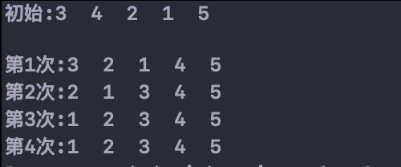

冒泡（Bubble）排序——相邻交换



```c
//冒泡排序(从小到大)
void bubbleSort(int *a, int n) {
    for (int i = 0; i < n - 1; i++) {
        for (int j = 0; j < n - i - 1; j++) {
            if (a[j] > a[j+1]) {
                int temp = a[j];
                a[j] = a[j+1];
                a[j+1] = temp;
            }
        }
    }
}
```


### 冒泡优化

冒泡有一个最大的问题就是这种算法不管不管你有序还是没序，闭着眼睛把你循环比较了再说。

比如我举个数组例子：\[ 9，8，7，6，5 \]，一个有序的数组，根本不需要排序，它仍然是双层循环一个不少的把数据遍历干净，这其实就是做了没必要做的事情，属于浪费资源。

针对这个问题，我们可以设定一个临时遍历来标记该数组是否已经有序，如果有序了就不用遍历了。

```
public static void sort(int arr[]){
    for( int i = 0;i < arr.length - 1 ; i++ ){
        boolean isSort = true;
        for( int j = 0;j < arr.length - 1 - i ; j++ ){
            int temp = 0;
            if(arr[j] < arr[j + 1]){
                temp = arr[j];
                arr[j] = arr[j + 1];
                arr[j + 1] = temp;
                isSort = false;
            }
        }
        if(isSort){
            break;
        }
    }
}
```


