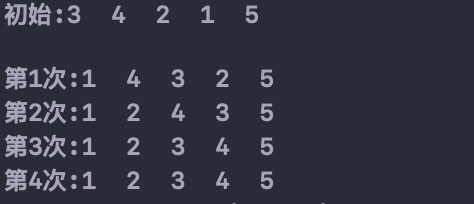

选择排序——每次最小/大排在相应的位置 



```c
//选择排序
//方法2:算出最小值后再交换两个的位置
//方法3：只用n/2次，同时算出最小值和最大值给最左边和最右边
void seletSort(int *a, int n) {
    for (int i = 0; i < n - 1; i++) {
        for (int j = i + 1; j < n; j++) {
            if (a[i] < a[j]) {
                int temp = a[i];
                a[i] = a[j];
                a[j] = temp;
            }
        }
    }
}
```

