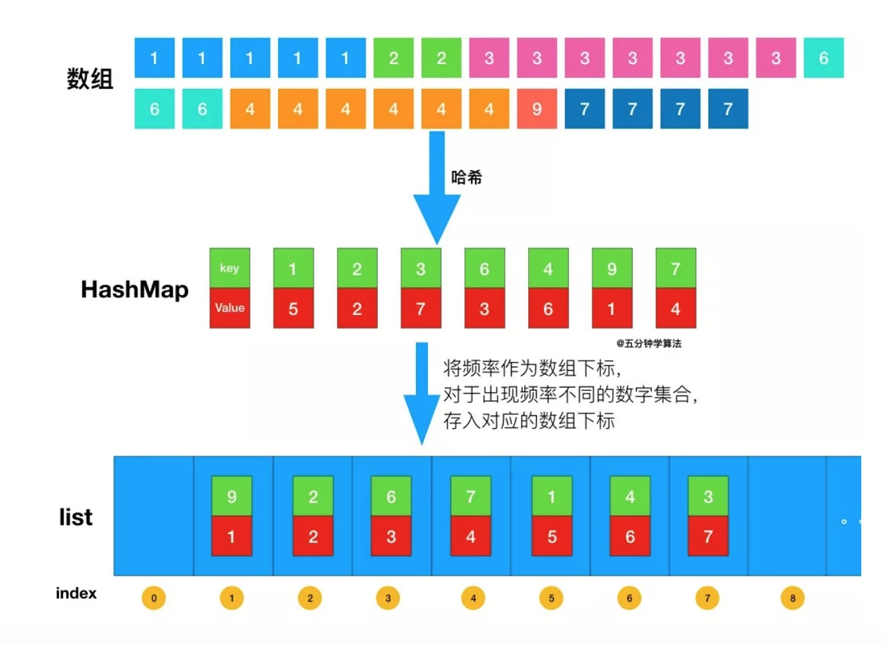

### **题目描述**


给定一个非空的整数数组，**返回其中出现频率前 k 高**的元素。

**示例 1:**

```
输入: nums = [1,1,1,2,2,3], k = 2
输出: [1,2]
```

**示例 2:**

```
输入: nums = [1], k = 1
输出: [1]
```

**说明：**

- 你可以假设给定的 k 总是合理的，且 1 ≤ k ≤ 数组中不相同的元素的个数。
- 你的算法的时间复杂度必须优于 O(n log n) ， n 是数组的大小。


### 解法：桶排序法

首先依旧使用哈希表统计频率，统计完成后，创建一个数组，将频率作为数组下标，对于出现频率不同的数字集合，存入对应的数组下标即可。



代码实现如下：

```
//基于桶排序求解「前 K 个高频元素」
class Solution {
    public List<Integer> topKFrequent(int[] nums, int k) {
        List<Integer> res = new ArrayList();
        // 使用字典，统计每个元素出现的次数，元素为键，元素出现的次数为值
        HashMap<Integer,Integer> map = new HashMap();
        for(int num : nums){
            if (map.containsKey(num)) {
               map.put(num, map.get(num) + 1);
             } else {
                map.put(num, 1);
             }
        }

        //桶排序
        //将频率作为数组下标，对于出现频率不同的数字集合，存入对应的数组下标
        List<Integer>[] list = new List[nums.length+1];
        for(int key : map.keySet()){
            // 获取出现的次数作为下标
            int i = map.get(key);
            if(list[i] == null){
               list[i] = new ArrayList();
            } 
            list[i].add(key);
        }

        // 倒序遍历数组获取出现顺序从大到小的排列
        for(int i = list.length - 1;i >= 0 && res.size() < k;i--){
            if(list[i] == null) continue;
            res.addAll(list[i]);
        }
        return res;
    }
}
```

#### 复杂度分析

- **时间复杂度**：O(n)， n 表示数组的长度。首先，遍历一遍数组统计元素的频率，这一系列操作的时间复杂度是 O(n)；桶的数量为 n + 1，所以桶排序的时间复杂度为 O(n)；因此，总的时间复杂度是 O(n)。
- **空间复杂度**：O(n)

