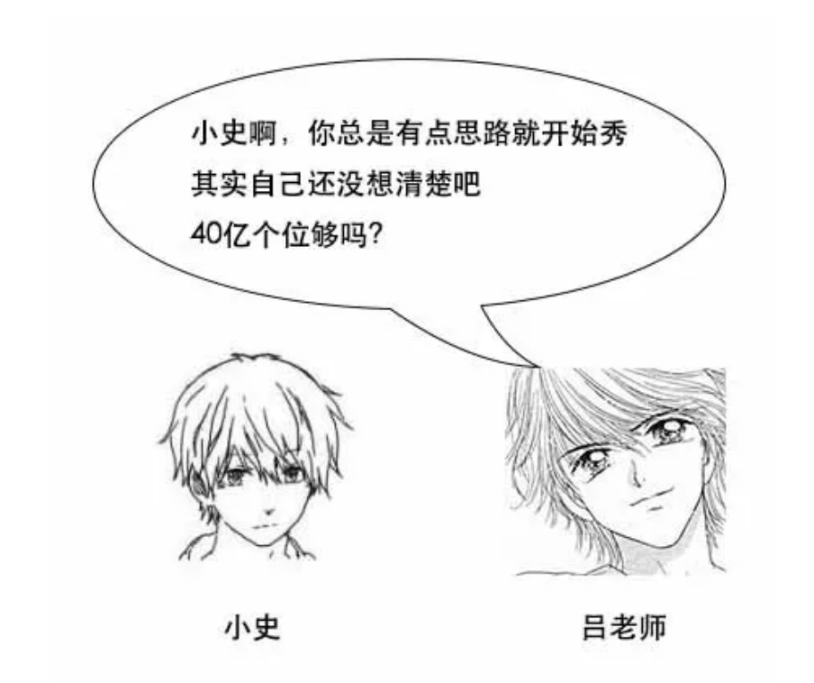
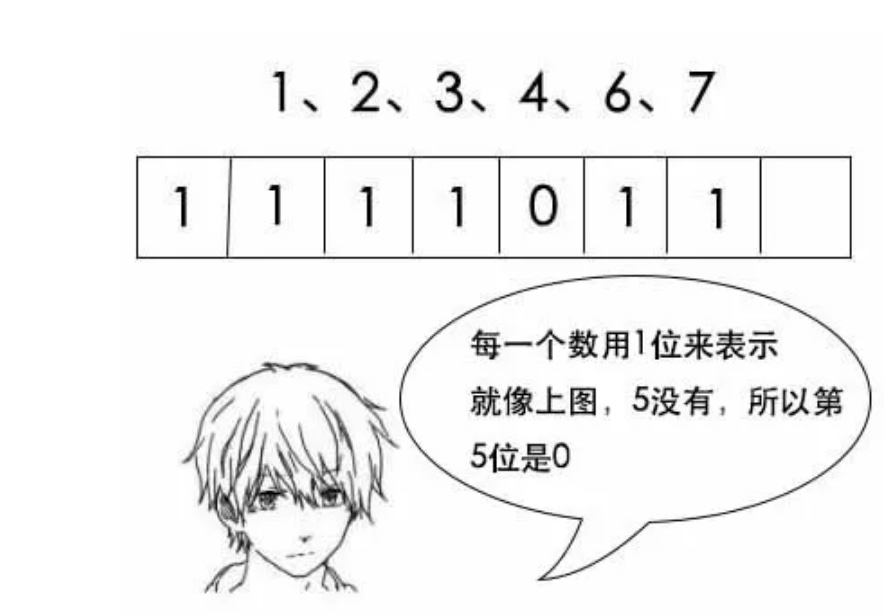
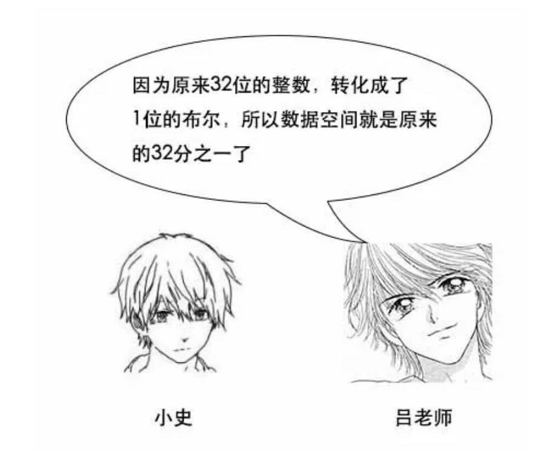

**题目：我有40亿个整数，再给一个新的整数，我需要判断新的整数是否在40亿个整数中，你会怎么做？**

小史：哦，对哦，这样我就申请40亿个位就好了，新的数转换成一个位，然后判断一下这个位是0还是1就行了。

吕老师：小史啊，考虑问题要考虑清楚啊，如果是40亿个位，那么这40亿个位哪些是0，哪些是1呢？来了一个新的数，怎么判断是否在40亿个位之中？

小史：我想想，对啊，40亿个位，40亿个数，那么每个位都是1，这。。。

吕老师：其实你可以想想，32位int的范围，总共就是2的32次方，大概42亿多点。所以你可以申请2的32次方个位。

小史：意思是我把整个整数范围都覆盖了，哦，对哦。这样一来，就可以做了，1代表第一个位，2代表第二个位，2的32次方代表最后一个位。40亿个数中，存在的数就在相应的位置1，其他位就是0。

吕老师：没错，那来了一个新的数呢？

小史：新的数就去找相应的位，比如来了一个1234，就找一下第1234位，如果是1就存在，是0就不存在啦。

吕老师：没错，那么这样的话，需要多大内存呢？

小史：我想想啊，2的32次方个位，相当于2的29次方个字节，哇，才500MB，真是节省了不少内存呢。

小史：这么厉害的算法，你是怎么想到的？

吕老师：其实这是一种非常有名的大数据算法，叫位图法，英文名叫bitmap。顾名思义，就是用位来表示状态，从而节省空间。明天正好我有一节课，就讲位图法，你可以来听一听。