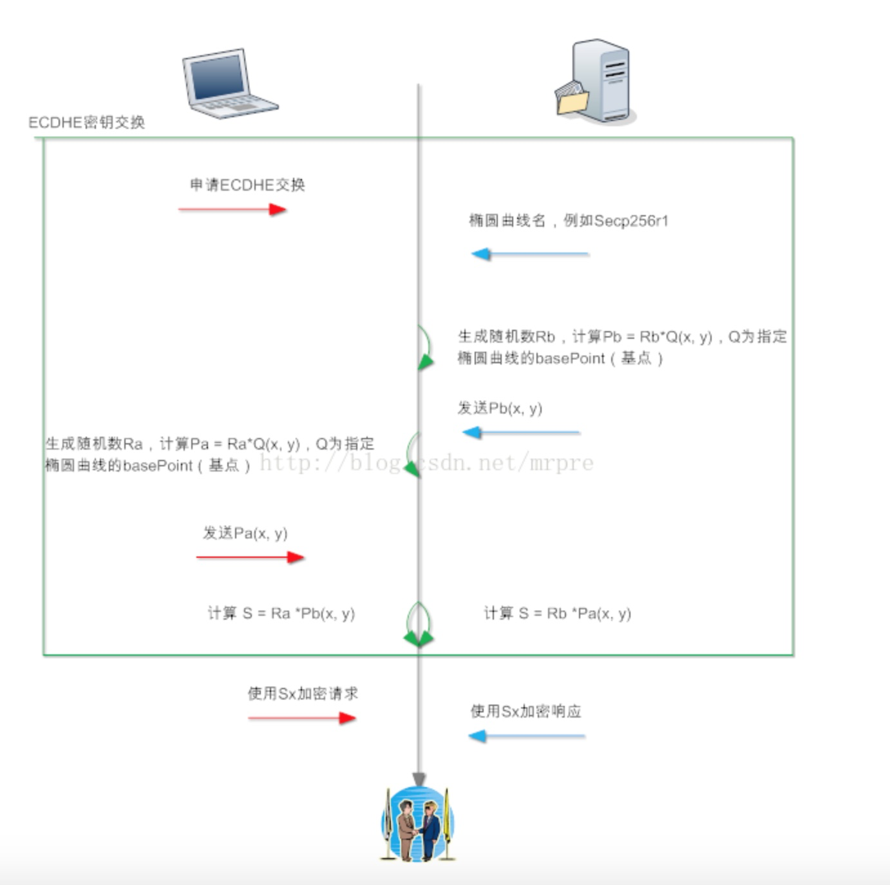

# HTTPS 中非对称加密方法比较

## RSA

RSA算法流程文字描述如下：

（1）：任意客户端对服务器发起请求，服务器首先发回复自己的公钥到客户端（公钥明文传输）。

（2）：客户端使用随机数算法，生成一个密钥S，使用收到的公钥进行 加密，生成C，把C发送到服务器。

（3）：服务器收到C，使用公钥对应的私钥进行解密，得到S。

（4）：上述交换步骤后，客户端和服务器都得到了S，S为密钥（和另外两个随机数运算后才是真正的 key）。

我们来看看上述过程中，为何第三方无法得到S。首先第一步后，客户端有公钥，服务器有公钥和私钥。由于公钥是明文传输的，所以可以假设第三方也有公钥。

第二步后，客户端发送C，服务器能够使用自己的私钥进行解密，而第三方只有公钥，无法解密。即第三方无法计算得到S

**RSA问题**

RSA有一个问题，就是如果私钥泄漏，即私钥被第三方知道，那么第三方就能从C中解密得到S，即只要保存所有的A和B的报文，等到私钥被泄漏的那一天，或者有办法快从C中计算S的方法出现（量子计算机分解大素数），那么A和B就没有什么私密性可言了。

这就是所谓的前向不安全，私钥参与了密钥交换，安全性取决于私钥是否安全保存

## DHE

DHE算法流程文字描述如下：

（1）：客户端计算一个随机值Xa，使用Xa作为指数，即计算Pa = q^Xa mod p，其中q和p是全世界公认的一对值。客户端把Pa发送至服务器，Xa作为自己私钥，仅且自己知道。

（2）：服务器和客户端计算流程一样，生成一个随机值Xb，使用Xb作为指数，计算

   Pb = q^Xb mod p，将结果Pb发送至客户端，Xb仅自己保存。

（3）：客户端收到Pb后计算Sa = Pb ^Xa mod p；服务器收到Pa后计算Sb = Pa^Xb mod p

（4）：算法保证了Sa = Sb = S，故密钥交换成功，S为密钥（预主密钥）。

上述密钥交换流程中，和RSA密钥交换有较大不同，DHE密钥交换时，服务器私钥没有参与进来。也就是说，私钥即使泄漏，也不会导致会话加密密钥S被第三方解密。

实际使用过程中，私钥的功能被削弱到用来身份认证。

DHE参数和Pb都是通过server key exchange发送给客户端，Pa通过client key exchange发送给服务器。server key exchange的结尾处需要使用服务器私钥对该报文本身进行签名，以表明自己拥有私钥

## ECDHE

ECDHE的全称叫Elliptic Curve Diffie–Hellman key Exchange椭圆曲线迪非-赫尔曼密钥交换，它是迪非-赫尔曼密钥交换的变种，使用椭圆曲线加密提高安全性。

只要理解DHE密钥交换原理，那么理解ECDHE密钥交换原理其实并不难（如果不想深究的话）。

ECDHE的运算是把DHE中模幂运算替换成了点乘运算，速度更快，可逆更难。

 

ECDHE算法流程文字描述如下：

（1）：客户端随机生成随机值Ra，计算Pa(x, y) = Ra * Q(x, y)，Q(x, y)为全世界公认的某个椭圆曲线算法的基点。将Pa(x, y)发送至服务器。

（2）：服务器随机生成随机值Rb，计算Pb(x,y) - Rb * Q(x, y)。将Pb(x, y)发送至客户端。

（3）：客户端计算Sa(x, y) = Ra * Pb(x, y)；服务器计算Sb(x, y) = Rb *Pa(x, y)

（4）：算法保证了Sa = Sb = S，提取其中的S的x向量作为密钥（预主密钥）。

  SSL协议中，上图中椭圆曲线名和Pb通过server key exchange报文发送；Pa通过client key exchange报文发送。

## ECDH

 

字面少了一个E，E代表了“临时”，即在握手流程中，作为服务器端，ECDH少了一步计算Pb的过程，Pb用证书中的公钥代替，而证书对应的私钥就是Xb。由此可见，使用ECDH密钥交换算法，服务器必须采用ECC证书；服务器不发送server key exchange报文，因为发送certificate报文时，证书本身就包含了Pb信息。

## 几种算法的安全性

ECDHE（DHE）算法属于DH类密钥交换算法， 私钥不参与密钥的协商，故即使私钥泄漏，客户端和服务器之间加密的报文都无法被解密，这叫 前向安全（forward secrity）。由于ECDHE每条会话都重新计算一个密钥（Ra、Rb），故一条会话被解密后，其他会话仍旧安全。

然而，ECDH算法服务器端的私钥是固定的，即证书的私钥作为Rb，故ECDH不被认为前向安全，因为私钥泄漏相当于Rb泄漏，Rb泄漏，导致会话密钥可被第三方计算。ECDH交换算法已经被OpenSSL废弃:https://github.com/openssl/openssl/commit/ce0c1f2bb2fd296f10a2847844205df0ed95fb8e#diff-d615181712e5a3ed0a51d3222d96e1d4  

**总结:目前主要以 ECDHE(google) 算法为主**

 

