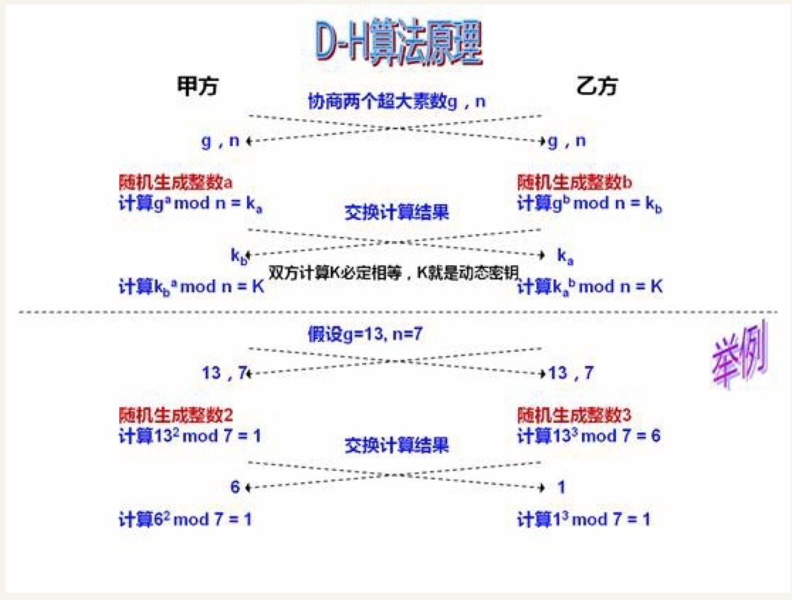

## **Diffie-Hellman 算法**

前一篇文章主要讲了 SSL 协议的握手过程，由于握手交换随机数的过程是不加密的，因此，如果有人窃听通信，他可以知道双方选择的加密方法，以及三个随机数中的两个。整个通话的安全，只取决于第三个随机数（Premaster secret）能不能被破解。

虽然理论上，只要服务器的公钥足够长（比如2048位），那么Premaster secret可以保证不被破解。但是为了足够安全，我们可以考虑把握手阶段的算法从默认的RSA算法，改为 Diffie-Hellman算法（简称DH算法）。

采用DH算法后，Premaster secret不需要传递，双方只要交换各自的参数，就可以算出一个相同的会话密钥。
DH 算法原理

Diffie-Hellman 算法把传递 PreMaster Secret 变成了传递 DH parameter。然后服务器和客户端根据 DH parameter 计算得出一个相同的会话密钥。