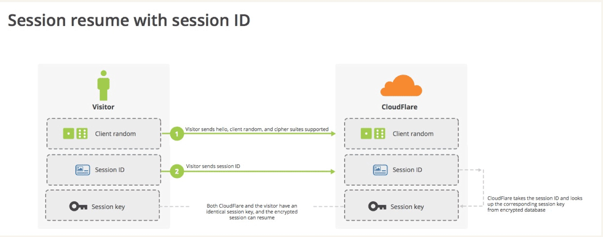
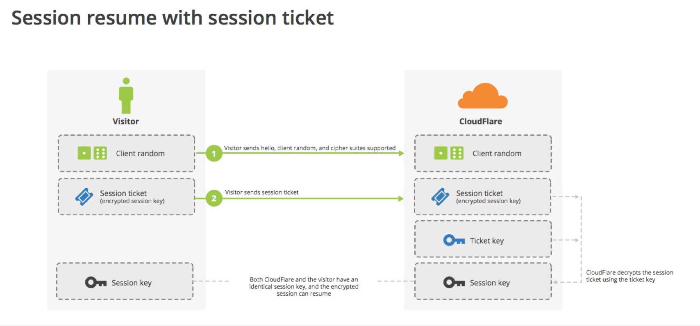
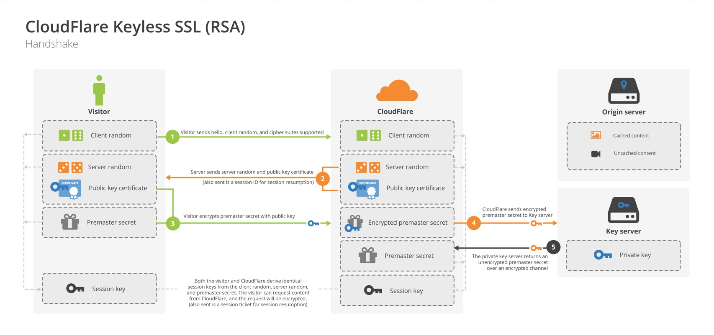
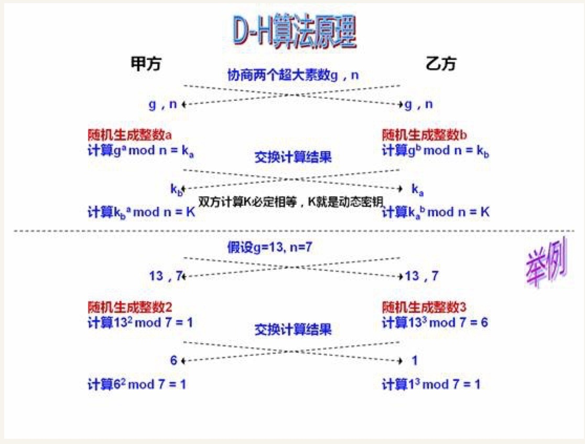

# HTTPS 密钥复用

HTTP 建立 TCP 链接需要进行三次握手，HTTPS 在 TCP 之上又加上了 TLS 的握手过程，也就是说单建立链接的过程是相当耗时的。如果每次请求建立链接都要进行这样繁琐的握手过程，那显然是不能忍的，所以就提出了对 TLS 已经协商好的密钥重用。有两种方法，一种叫做 session ID 另一种叫做 session ticket。

## session ID

session ID的思想很简单，就是每一次对话都有一个编号（session ID）。如果对话中断，下次重连的时候，只要客户端给出这个编号，且服务器有这个编号的记录，双方就可以重新使用已有的”对话密钥”，而不必重新生成一把。

上图中，客户端给出session ID，服务器确认该编号存在，双方就不再进行握手阶段剩余的步骤，而直接用已有的对话密钥进行加密通信。

## session ticket

session ID的缺点在于session ID往往只保留在一台服务器上。所以，如果客户端的请求发到另一台服务器，就无法恢复对话。session ticket就是为了解决这个问题而诞生的。

上图中，客户端不再发送session ID，而是发送一个服务器在上一次对话中发送过来的session ticket。这个session ticket是加密的，只有服务器才能解密，其中包括本次对话的主要信息，比如对话密钥和加密方法。当服务器收到session ticket以后，解密后就不必重新生成对话密钥了。

## **如何使用 CDN**

网站为了加快访问速度通常会使用 CDN，如果使用外部 CDN，我们通常不会把私钥交给 CDN 服务商，针对这种场景 CloudFlare 公司提出了一种解决方案 —— Keyless SSL。

上图中主要区别在于第四步，CDN 提供商拿到前一步由源服务器公钥加密过的密文后，通过安全的信道交给源服务器来解密，由源服务器提取会话秘钥或完成签名以后再提交给 CDN 节点。如此 CDN 就获得了此次回话的密钥。

## **Diffie-Hellman 算法**

前一篇文章主要讲了 SSL 协议的握手过程，由于握手交换随机数的过程是不加密的，因此，如果有人窃听通信，他可以知道双方选择的加密方法，以及三个随机数中的两个。整个通话的安全，只取决于第三个随机数（Premaster secret）能不能被破解。

虽然理论上，只要服务器的公钥足够长（比如2048位），那么Premaster secret可以保证不被破解。但是为了足够安全，我们可以考虑把握手阶段的算法从默认的RSA算法，改为 Diffie-Hellman算法（简称DH算法）。

采用DH算法后，Premaster secret不需要传递，双方只要交换各自的参数，就可以算出一个相同的会话密钥。
DH 算法原理

Diffie-Hellman 算法把传递 PreMaster Secret 变成了传递 DH parameter。然后服务器和客户端根据 DH parameter 计算得出一个相同的会话密钥。