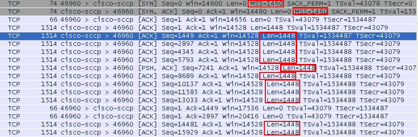

# TCP传输的单个报文最大字节（MSS和MTU）

## TCP和1448

1448字节是实际场景下，单个TCP包的实际运载能力

。也就是说，实际场景下，上层调用send（1000KB），下层会把这1000KB封装成多个TCP包进行发送。

单个TCP包每次打包1448字节的数据进行发送。
详细的TCP在传输情景wireshark截图如图

每个TCP包在理论上应该能打包更多数据才对，但是实际场景下

TCP传输为什么会以这个1448作为打包单位呢？

这个实际TCP单包传输1448字节数据的根源在于“以太网Ethernet最大的数据帧是1518字节”。

## 1500字节的MTU 

以太网Ethernet最大的数据帧是1518字节。以太网帧的帧头14字节和帧尾CRC校验4字节（共占18字节

），剩下承载上层协议的地方也就是Data域最大就只剩1500字节. 这个值我们就把它称之为MTU。

我们来看看linux上MTU默认值，查证一下，

这个MTU值可以修改，但是现在大部分计算机网络都被以太网承载，所以修改这个值没有什么实际意义。

## MSS决定TCP的单包传输量

MSS就是TCP数据包每次能够传输的最大量。为了达到最佳的传输效能，TCP协议在建立连接的时候通常要协商双方的MSS值，这个值TCP协议在实现的

时候往往用MTU值代替（需要减去IP数据包包头的大小20Bytes和TCP数据段的包头20Bytes）所以往往MSS为1460（如图1中红色方框所示的SYN包中的MSS值）。通讯双方会根据双方提供的MSS值得最小值确定为这次连接的最大MSS值。

MSS为1460是由1500-20（IP头）-20（TCP头）计算出的。
实际场景下，TCP包头中会带有12字节的选项----时间戳。
这样，单个TCP包实际传输的最大量就缩减为1448字节。1448=1500-20（IP头）-32（20字节TCP头和12字节TCP选项时间戳）

## 回到我们开篇的问题

“每个TCP包在理论上应该能打包更多数据才对，但是实际场景下TCP传输为什么会以这个1448作为打包单位呢？”

理论上，单个TCP包能打包的数据量远远多于1448字节，现在为了适应MTU，只要在以太网上跑TCP，系统就默认最大以1448字节打包TCP。

假如我们用更大的数据量来打包会有什么结果呢？

答案是降低了传输效率。

超过MTU的大包反而降低效率的原因如下：

IP层非常关心MTU，因为IP层会根据MTU来决定是否把上层传下来的数据进行分片。就像一条运输线路的承载能力是有限的，碰到大东西要运输，只能把大东西拆开成为散件，分开运输，到达目的地之后还必须能再次组装起来。

当两台远程PC互联的时候，它们的数据需要穿过很多的路由器和各种各样的网络媒介才能到达对端，网络中不同媒介的MTU各不相同，就好比一长段的水管，由不同粗细的水管组成（MTU不同 :)）通过这段水管最大水量就要由中间最细的水管决定。

对于网络层的上层协议而言（我们以TCP/IP协议族为例）它们对水管粗细不在意它们认为这个是网络层的事情。网络层IP协议会检查每个从上层协议下来的数据包的大小，并根据本机MTU的大小决定是否作“分片”处理。分片最大的坏处就是降低了传输性能，本来一次可以搞定的事情，分成多次搞定，所以在网络层更高一层（就是传输层）的实现中往往会对此加以注意！
这个就是在以太网上，TCP不发大包，反而发送1448小包的原因。只要这个值TCP才能对链路进行效能最高的利用。