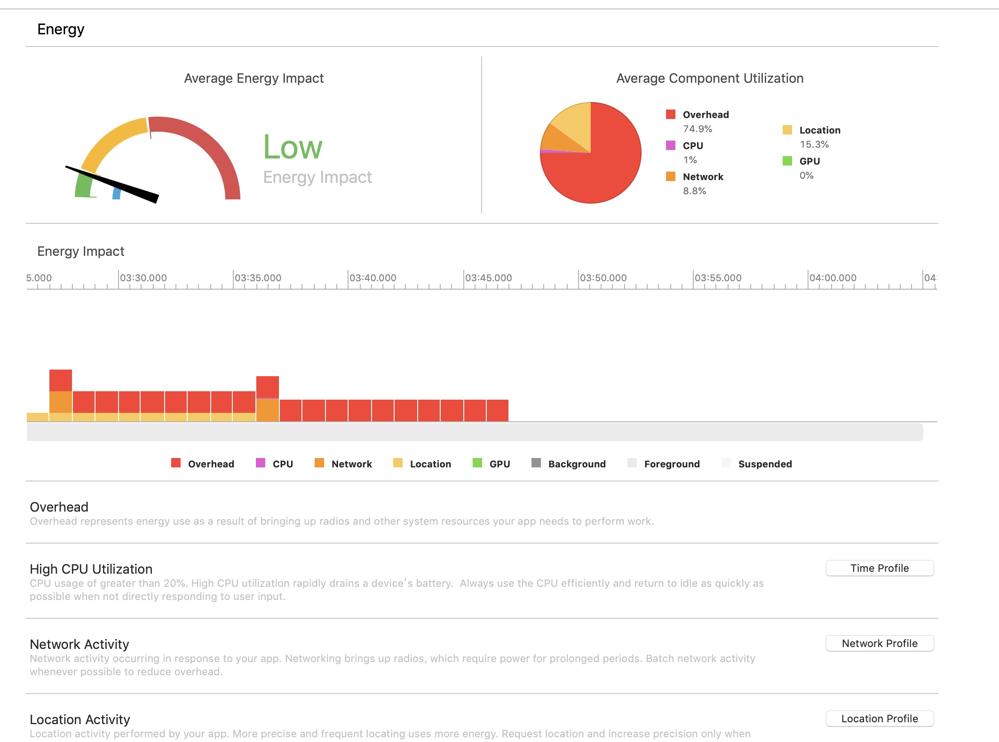
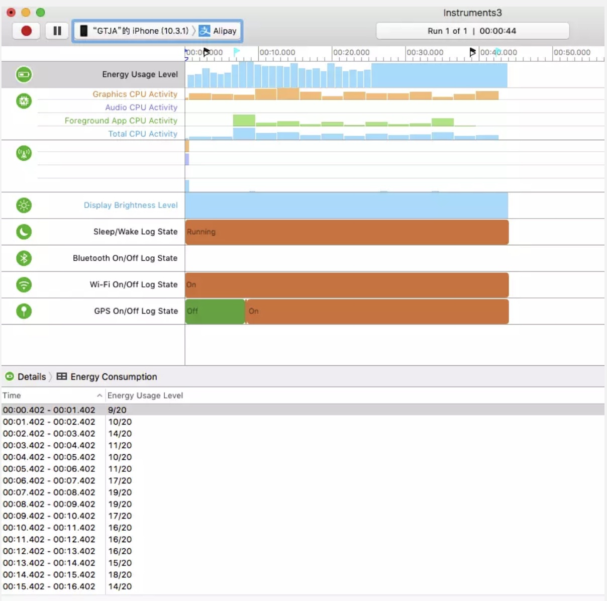
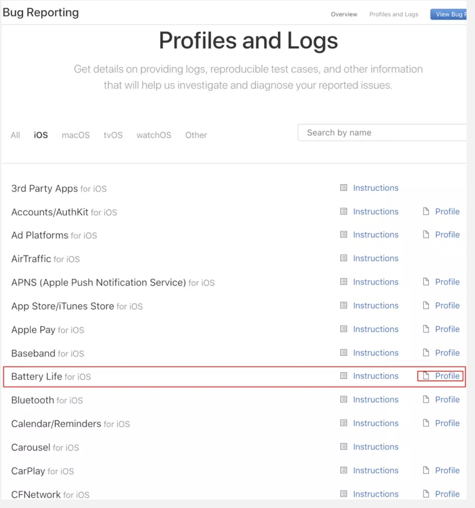
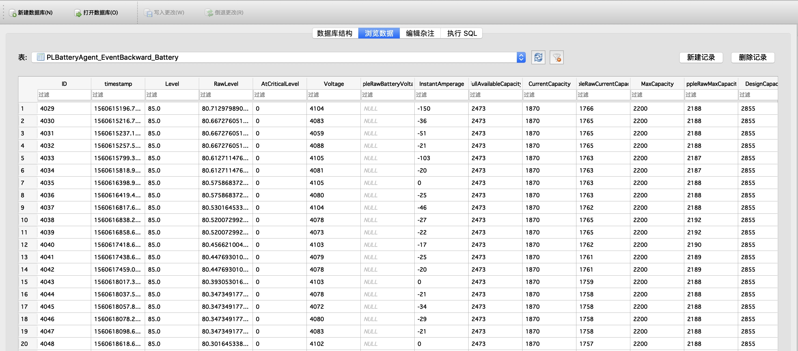

# iOS 电量优化


## 耗电检测


### 1.普通检测

一般方法为非开发人员测试的方法，iOS12以上可在 `设置->电池` 查看每小时对应APP的耗电量百分比，再结合电量减少了多少，能粗略计算出对应APP的耗电量


### 2.Xcode(Energy Impact)

真机运行Xcode,可以查看APP对应的耗电信息

- 蓝色表示--合理

- 黄色--表示程序比较耗电

- 红色--表示仅仅轻度使用你的程序,就会很耗电

右边会显示各个模块耗电的百分比




### 3.Instruments(Energy log)

在手机端`设置->开发者->Logging->打开Energy->Start Recording`可以开始录制一段时间手机的电量消耗，我们可以在这段时间内运行我们APP对应的模块，以此来检测这个模块的耗电量；录制完成后连接电脑，打开Instruments中的Energy Log,点击工具栏中import Logged Data from Device，就可以得到了电池损耗日志

- Energy Usage Level的值(0 -- 20),值越大表示越耗电
- CPU Activity 表示CPU各种活动





### 4.利用sysdiagnose进行耗电量测试

sysdiagnose是苹果的日志系统，苹果经常会询问是否要官方帮忙诊断和定位各种问题，使用的就是sysdiagnose的日志。Sysdiagnose很庞大，记录电池、第三方APP、各种系统功能和应用的所有运行情况。比如，设置->电池里面的电池用量就是使用Sysdiagnose的数据。下面具体介绍如何使用Sysdiagnose进行耗电测试。

首先，Sysdiagnose需要一个开发者账号，在手机上安装所需要的证书，安装证书之后，手机不需要越狱也可以获得数据

官网下载证书 [Profiles and Logs](https://link.jianshu.com?t=https%3A%2F%2Fdeveloper.apple.com%2Fbug-reporting%2Fprofiles-and-logs%2F%3Fplatform%3Dios)。（需要开发者证书）





安装完描述文件后等待一段时间后手机连上电脑，通过 iTunes 同步到电脑上

打开`~/Library/Logs/CrashReporter/MobileDevice`  ->手机名->powlog_xxxx.PLSQL 文件

其中最重要的表是`PLBatteryAgent_EventBackward_Battery`整机电量信息，每20s采集一次，在关闭其他app的情况下，可以近似的认为是所测app的耗电，如图





这个表中记录了对应时间戳的手机剩余电量，电压，电流（正数是在充电，负数是耗电），这个表还有温度数据，可以反映测试期间手机的温度变化

- 1、电流以mA计，iphone工作时候，电流一般在0～700mA之间，超过500mA手机就很容易发热

- 2、电压以mV计，iphone工作时候电压在4V左右，当然电量比较充足的时候比低电量时候电压高，但是一般不超过0.2V

-  3、剩余电量是以mAh计，他和最大电量是相对值，我们看到的电量百分比是这两个值的比值。

- 4、温度可以作为参考值，测试中最高温度是37度左右，能明显感到发烫。

- 5、每一个安装到iPhone的应用，在系统级都会有一个ID标注，称作结点ID。

- 6、系统中每个应用都有几种状态，分别是不运行、前台活跃、前台不活跃（一般应用间切换时出现）、后台、暂停（在后台但没有运行，程序还在内存中）。

  以上这些状态都可以从数据库表中获得。

  

有了这些数据就能算出这段时间的耗电量  `耗电量（J）=电流（A）*电压（V）*时间（s）`。


使用sysdiagnose进行iOS耗电量测试一般流程如下：

- 1、准备测试用例
- 2、执行前手机保持80%以上的电量（这个电量手机电压比较稳定），手机降温到室温
- 3、测试时候断开电源，手动操作
- 4、记录每个用例的开始执行时间，结束时间（时间戳）
- 5、执行结束，记录时间，等待5分钟左右
- 6、使用ituns同步数据到电脑（可以几次执行结果一起同步），进行后续计算


为方便测试，写了一个计算一段时间耗电量的Python程序

```python
import sqlite3

conn = sqlite3.connect('powerlog_2019-06-16-2019-06-18_AD7EBC89.PLSQL')
cursor = conn.cursor()
cursor.execute('select id,timestamp,Level,Voltage,InstantAmperage from  PLBatteryAgent_EventBackward_Battery where timestamp > 1560765600 and timestamp < 1560769200')
values = cursor.fetchall()
cursor.close()
conn.close()

sum = 0
oldTime = 0
sumTime = 0

for value in values:
    print(value[0], value[1], value[2], value[3], value[4])
    if oldTime > 0:
        t = value[1] - oldTime
        sumTime += t
        sum = value[3]/1000 * value[4]/1000 * t
    oldTime = value[1]

print("总时间:", sumTime, '秒')
print('总消耗:',  sum, 'J')
print('平均:', sum/sumTime, 'J/秒')
```


## 实践


结合上面的检测方法，显然sysdiagnose能准确的算出一段时间的耗电量，便于优化前后的对比

以下为优化一个后台持续定位并上报的APP前后的比较


### 优化前

测试1小时电量消耗6%

总时间: 3570.607927083969 秒
总消耗: -6.955537700700045 J
平均: -0.0019479981680263808 J/秒


### 定位精度优化后

主要修改了

- 持续定位distanceFilter改为10米

- 持续定位desiredAccuracy改为 kCLLocationAccuracyNearestTenMeters
- 减少多余的逆地理信息


测试1小时电量消耗2%

总时间: 3570.6812930107117 秒
总消耗: -6.036738313244819 J
平均: -0.001690640473867324 J/秒

大约节约了13.2%电量


### 使用播放无声音乐方案

此方案主要是不使用持续定位，用后台播放无声音乐的方式让APP保活，再在指定时间间隔内进行定位


测试1小时电量消耗3%

总时间: 3572.893536090851 秒
总消耗: -3.5914743739242554 J
平均: -0.0010052005013991361 J/秒

大约节约了48%电量


显而易见我们最后采用了播放无声音乐的方案，同时发现电量百分比跟电量消耗的误差还是很大的，因为在电量刚充满时消耗2%和电量不足消耗的2%也是完全不相等的，所以最好使用表中数据进行计算电量消耗更准确


## 减少耗电优化点

- 减少请求(合并上传)
- 按需调用(如定位不需要持续时可用其它方案)
- 频率控制(如上报、定位等的频率)
- 避免CPU、GPU大量操作或者重复计算(如缓存计算结果、减少等方法)

